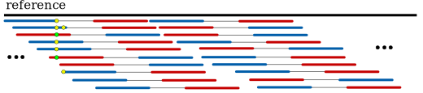

# SOBDetector

## 1. Theoretical background
There are two options to choose from when collecting and preserving tumor specimens for molecular analysis: fresh frozen (FF) or formalin-fixed paraffin-embedded (FFPE). While inserting a tissue into a phenol solution and fresh freezing it directly after resection results in an excellent stability, keeping it under -80 °C is indisputably more expensive, than embedding it into paraffin blocks after formalin fixation. This fixation process however, introduces artifactual mutations (mostly in the C>T direction due to the deamination of cytosine bases induced by formalin) into the DNA strands which results in a much lower quality. The major benefit of this ffpe procedure is that the specimen becomes no longer sensitive to heat, so it can be work with at room temperature.

Due to its cost effectiveness and simplicity, ffpe tissue processing remains the most common approach for tissue specimen storage. However, the presence of these artifactual mutations makes mutation calling (especially point mutation calling) a hard task. Over the past years, various amounts of tools have been created that have made the extraction of allele-specific segmentation data and copy number profiles from whole exome sequences (WES) possible (sequenza, ASCAT, …). However, in order to ensure this allele specificity these tools rely on heterogeneous positions, which can be strongly affected by the presence of these ffpe artifacts, making the final copy number estimations unreliable. Also, the well known somatic signatures (Alexandrov et al.) depend solely on the point mutations found in a tumor sample. It is imperative therefore, that before performing these analyses we ensure, that the mutations found by a variant caller are real, not mere artifacts.

Since formalin very likely affects only one of the strands (e.g. a C|G pair becomes T|G), a paired-end next generation sequencing approach can help in this additional filtering step. By counting not just the number of reads that support the alternative alleles, but the relative orientation of the reads as well (Forward-Reverse:FR or Reverse-Forward:RF), these ffpe artifacts will likely to have a strand orientation bias towards one of the directions, while true mutations should have approximately the same amount of FR and RF reads. This article is based on a tool: Strand Orientation Bias Detector (SOBDetector), that reanalyzes the mutations stored in a vcf by any mutation caller, and evaluates whether the reads which support the alternate alleles have a strand orientation bias using the original binary alignment (BAM) files. This method works only on Illumina-like sequencing approaches.

## 2. Method

During sequencing, we first fragment the DNA in (ideally) isotermal conditions. Then we ligate the adapter sequences, the primers, indices and sequences that are complementary to the oligose found in the flow cell to the ends of these fragments:

Since both the Crick and Watson strands have read1s and read2s on them, after the alignment there sould be approximately the same amount of F1R2 and F2R1 "constellations" in the resulting binary alignment files:

Since the mutations induced by the storing process can be found only in one of the strands, they are likely to have a bias in the F1R2 and F2R1 orientation as well:

SOBDetector

