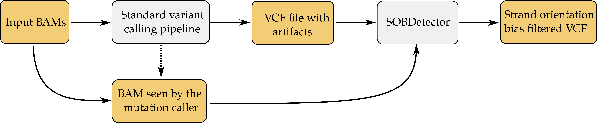
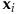
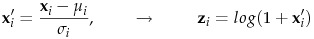
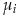
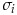

# SOBDetector

#### Download link: [https://github.com/mikdio/SOBDetector/releases](https://github.com/mikdio/SOBDetector/releases)

## 1. Theoretical background
There are two options to choose from when collecting and preserving tumor specimens for molecular analysis: fresh frozen (FF) or formalin-fixed paraffin-embedded (FFPE). While inserting a tissue into a phenol solution and fresh freezing it directly after resection results in an excellent stability, keeping it under -80 °C is indisputably more expensive, than embedding it into paraffin blocks after formalin fixation. This fixation process however, introduces artifactual mutations (mostly in the C>T direction due to the deamination of cytosine bases induced by formalin) into the DNA strands which results in a much lower quality. The major benefit of this ffpe procedure is that the specimen becomes no longer sensitive to heat, so it can be work with at room temperature.

Due to its cost effectiveness and simplicity, ffpe tissue processing remains the most common approach for tissue specimen storage. However, the presence of these artifactual mutations makes mutation calling (especially point mutation calling) a hard task. Good example is the extraction of the well known somatic single nucleotide substitution signatures ([Alexandrov et al., 2013](https://www.ncbi.nlm.nih.gov/pubmed/23945592)), which depend solely on the point mutations found in a tumor sample. It is imperative therefore, that before performing these analyses we ensure, that the mutations identified by a variant caller and piped into analytical tools are real, and not artifacts.

Since formalin very likely affects only one of the strands (e.g. a C|G pair becomes T|G), a paired-end next generation sequencing approach can help in this additional filtering step. By counting not just the number of reads that support the alternative alleles, but the relative orientation of the reads as well (Forward-Reverse:FR or Reverse-Forward:RF), these ffpe artifacts will likely to have a strand orientation bias towards one of the directions, while true mutations should have approximately the same amount of FR and RF reads. 

## 2. Method

During sequencing, we first fragment the DNA in (ideally) isotermal conditions. Then we ligate the adapter sequences, the primers, indices and sequences that are complementary to the oligose found in the flow cell to the ends of these fragments:

Since both the Crick and Watson strands have read1s and read2s on them, after the alignment there sould be approximately the same amount of F1R2 and F2R1 "constellations" in the resulting binary alignment files:

Since the mutations induced by the storing process can be found only in one of the strands, they are likely to have a bias in the F1R2 and F2R1 orientation as well:

**Strand Orientation Bias Detector (SOBDetector) is a tool that reanalyzes the mutations stored in a vcf (by any mutation caller), and evaluates whether the reads which support the alternate alleles have a strand orientation bias using the original binary alignment (BAM) files.** This method was designed on Illumina-like paired-end sequencing data. Although it was created for human somatic mutation filtration, it can be used on samples of any species and in a germline variant calling analysiss as well.

After the collection of the strand-orientation bias info, the tool uses it to predict the probability that a variant is a sequencing artifact by using the posterior distribution of a Bayesian logistic regression model, that was trained on TCGA data.

## 3 Requirements
SOBDetector is a portable jar file, written in java 1.8. Apart of a java runtime environment, it only requires the presence of a relatively recent version of samtools (recommended v1.6 and above) in the system. 

## 4 Usage
The current version (v1.0) of SOBDetector can be used in two ways. 

### 4.1 Using a vcf file as input

The first is the regular one, when the user provides the location of a vcf file and its corresponding BAM's. This can be implemented in the following way:

<pre style="color:#F0F0F0; font-family:monospace; background:#333333">
java -jar SOBDetector_v1.0.jar \ 
    --input-type VCF \ 
    --input-variants ./input-variants.vcf \ 
    --input-bam ./input.bam \ 
    --output-variants ./output.vcf \ 
    --only-passed true
</pre>

In line 1 we provide SOBDetector for the java virtual machine. Optional java arguments such as the maximum amount of allowed memory or number of threads can be specified here, though multi-threading is not supported and the only thing that is stored in the heap is the vcf file itself, which is generally less than 100 Mb in size.
From line two we provide the mandatory arguments. These are the following:
 The type of the provided variant file. It can either be "VCF" or "Table" (we'll discuss the latter later).
 
* <strong> --input-variants: </strong>  Absolute or relative path that leads to the variant file (in this case, to a vcf).
* <strong> --inpupt-bam: </strong> Absolute or relative path of the binary alignment file, from which the variants were determined. It is important that in case the variant caller alters the original orientation of the reads while its running, for example by performing local de-novo assembly, we use the altered BAM file here.
* <strong> --output-variants </strong> Absolute or relative path to the desired output file. If the input is a vcf file, then this will be a vcf too. Note: all the folders must exist, the tool won't create them automatically.

A semi-mandatory argument:

* <strong> --sample-name: </strong> It is possbile that a BAM file contains reads from mutliple samples. If this is the case, the header of the bam must contain the name of the samples. When SOBDetector encounters multiple sample names among the read groups, it produces an error:
<pre style="color:#F0C000; font-family:monospace; background:#333333">
ERROR: /home/user/Path/samples.bam contains reads from multiple samples:
SAMPLE1
SAMPLE2
SAMPLE3
Use the --sample-name argument to specify which one you are interested in!
</pre>
It asks the user to specify the sample of interest with the <strong> --sample-name </strong> argument, for example:
<pre style="color:#F0F0F0; font-family:monospace; background:#333333">
java -jar SOBDetector_v1.0.jar \ 
    --input-type VCF \ 
    --input-variants ./input-variants.vcf \ 
    --input-bam ./input.bam \ 
    --sample-name SAMPLE1
    --output-variants ./output.vcf \ 
    --only-passed true
</pre>

The rest of the arguments are optional:

* <strong> --only-passed</strong> Defaults to false, if set true, variants that have non-PASSED FILTER attributes in the input vcf will be ignored. (It speeds up execution time.)
* <strong> --minBaseQuality</strong> Defaults to 0, the minimally considered base quality. If the quality of the considered base is less than this value, the read will be ignored.
* <strong> --minMappingQuality</strong> Defaults to 0, the minimally considered mapping quality. If the mapping quality of read is less than this value, then the read is ignored.
* <strong> --standardization-parameters</strong> The Bayesian prediction model requires the standardization and log-transformation of the predictive variables ():

where  and  are the mean and standard deviation of attribute _i_. The attributes are: <strong>TUMOR.ALT:</strong> number of alternate allele supporting reads at a given genomic coordinate, <strong>TUMOR.depth:</strong> number of reads covering a given genomic coordinate, <strong>TUMOR.AF:</strong> tumor allelic frequency (AF = ALT/depth),  <strong>SOBscore:</strong> the strand orientation bias score, evaluated by the tool. 
By default, the tool uses the means and standard deviations of the TCGA dataset, on which the Bayesian model was originally trained, however, when the user have multiple samples, that belong to the same cohort, it is worth to use the means and standard deviations of the whole cohort instead. This can be specified by the <strong>--standardization-parameters</strong> argument. The parameters need to be stored in a simple tab-delimited text file, the first line of which should contain the means, the second the standard deviations of the four attributes. Example altStandardization.txt: 
<pre style="color:#F0F0F0; font-family:monospace; background:#333333">
TUMOR.ALT	TUMOR.depth	TUMOR.AF	SOBScore
3.367	14.71	0.544	0.513
0.811	4.052	0.152	0.227
</pre>
And the way to specify this:
<pre style="color:#F0F0F0; font-family:monospace; background:#333333">
java -jar SOBDetector_v1.0.jar \ 
    --standardization-parameters ./altStandardization.txt
    --input-type VCF \ 
    --input-variants ./input-variants.vcf \ 
    --input-bam ./input.bam \ 
    --sample-name SAMPLE1
    --output-variants ./output.vcf \ 
    --only-passed true
</pre>

#### The output:

The output in this case is also a vcf file: the original vcf with the appended strand orientation bias info. The following line shows an example of this extra info through a single variant:

<pre style="color:#F0F0F0; font-family:monospace; background:#333333">
numF1R2Alt=3;numF2R1Alt=1;numF1R2Ref=13;numF2R1Ref=15;numF1R2Other=0;numF2R1Other=0;SOB=0.5000;pArtifact=7.504e-01;artiStatus=snv
</pre>

* <strong>numF1R2Alt:</strong> Number of alternate allele supporting reads in the F1R2 orientation
* <strong>numF2R1Alt:</strong> Number of alternate allele supporting reads in the F2R1 orientation
* <strong>numF1R2Ref:</strong> Number of reference allele supporing reads in the F1R2 orientation
* <strong>numF2R1Ref:</strong> Number of reference allele supporting reads in the F2R1 orientation
* <strong>numF1R2Other:</strong> Number of F1R2 reads that do not support the reference nor the alternate alleles (example, REF:A, ALT:C, and the read supports a T)
* <strong>numF2R1Other:</strong> Number of F2R1 reads that do not support the reference nor the alternate alleles
* <strong>SOB:</strong> The strand orientation bias score calculated from the first two attributes of this list.
* <strong>pArtifact:</strong> The posterior probability that the variant is a sequencing/storing/preparation/etc... artifact
* <strong>artiStatus:</strong> The predicted status of the variant, it is either <strong>snv</strong> or <strong>artifact</strong>

### 4.2 Using a tabulated file as input

Many times the variants we are working with are collected into tab-delimited files (or R/pandas data frames). SOBDetector can work with this format too. All we have to do is to specify our intentions by setting the input-type to "Table" instead of "Vcf":

<pre style="color:#F0F0F0; font-family:monospace; background:#333333">
java -jar SOBDetector_v0.1.jar \ 
    --input-type Table \ 
    --input-variants ./input.table \ 
    --input-bam ./input.bam \ 
    --output-variants ./output.table \ 
</pre>

Only the first four columns of such tab delimited files are mandatory. The necessary order of these attributes (using the standard vcf notation) has to be the following: 

| CHROM | POS | REF | ALT |

The file might contain other columns as well those will not be assessed. The output file of the analysis will have the same format as the input, containing the same columns, but additional attributes will be appended to them with the strand bias information. 

<strong>Note:</strong> With the exception of the --passed-only argument, all the non-mandatory arguments can be specified in this mode as well. (The --passed-only argument in table mode is not checked, all the variants in the table file will be evaluated!)

#### The output:

The output in this case is also a tabulated file: the original file with all of its columns, plus some extra columns containing the strand orientation bias info.

### 5 Contact
Although I have validated SOBDetector on multiple types of alignment files, I am certain that the tool is not prepared to every single situation it might encounter. In case it runs into a java exception, please do not hesitate to contact me! It would help a lot if you could send a few variants with an excerpt of your bam containing the reads spanning over those variants too, so I can instantly analyze the problem and get back to you as soon as possible (with the solution, preferably)!

[mikdio@cancer.dk](mailto:mikdio@cancer.dk) - Miklos Diossy

